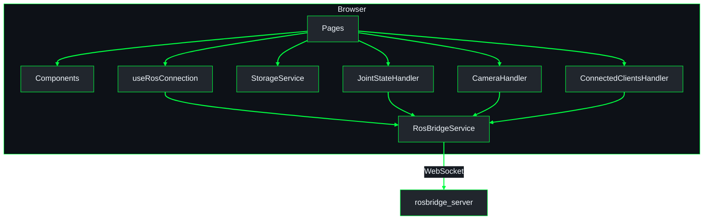

# Architecture Overview - lucy_control_panel

Browser-side Control Panel only.  
**Index:** [`lucy_ws/docs/architecture/README.md`](../../../../docs/architecture/README.md)  
**System schematic** (workspace + MCU + peripherals):  
[`lucy_ws/docs/architecture/overview.md`](../../../../docs/architecture/overview.md)  
**Conventions:** [`lucy_ws/docs/architecture/GUIDE.md`](../../../../docs/architecture/GUIDE.md)

## Module map

```
src/
├── Pages/          Route-level views (React components)
├── Components/     Shared UI components
├── Services/
│   ├── ros/        ROS Bridge communication layer
│   │   ├── ros.service.ts          WebSocket lifecycle singleton
│   │   └── handlers/               Topic-specific publish/subscribe logic
│   ├── storage.service.ts          LocalStorage persistence
│   └── axiosClient.service.ts      HTTP client (REST endpoints)
├── Constants/      Static config (ROS topics, joint mappings, types)
├── hooks/          Custom React hooks
└── Utils/          Pure helpers (math, logger)
```

## UI container diagram

**UML Component (Control Panel)** - React app inside the browser; rosbridge is the external edge.



Downstream ROS / hardware / MCU path is documented only in the
[workspace overview](../../../../docs/architecture/overview.md) - do not duplicate it here.

## Joint control data flow

**UML Component (joint command from UI)** - slider degrees to `ros2_control` radians and readback.

```mermaid
%%{init: {"theme": "base", "themeVariables": {"darkMode": true, "background": "#0d1117", "mainBkg": "#21262d", "primaryColor": "#21262d", "primaryTextColor": "#f0f6fc", "primaryBorderColor": "#00FF41", "secondaryColor": "#161b22", "secondaryTextColor": "#f0f6fc", "secondaryBorderColor": "#00FF41", "tertiaryColor": "#161b22", "tertiaryTextColor": "#f0f6fc", "tertiaryBorderColor": "#00FF41", "lineColor": "#00FF41", "textColor": "#f0f6fc", "nodeTextColor": "#f0f6fc", "edgeLabelBackground": "#161b22", "clusterBkg": "#0d1117", "clusterBorder": "#00FF41", "titleColor": "#f0f6fc"}}}%%
flowchart LR
  User["User"] -->|"servo deg"| Slider["JointControl"]
  Slider -->|"onJointChange"| Panel["RobotControlPanel"]
  Panel -->|"servoDegToJointRad"| JSH["JointStateHandler"]
  JSH -->|"JointTrajectory"| WS["RosBridgeService"]
  WS -->|"WebSocket rad"| ROS["ros2_control"]
  ROS -->|"joint_states rad"| JSH
  JSH -->|"jointRadToServoDeg"| Slider
  linkStyle default stroke:#00FF41,stroke-width:2px
```



| Stage | Unit |
|-------|------|
| Slider | servo degrees |
| Wire to `ros2_control` | URDF radians |
| `/joint_states` readback | URDF radians → servo degrees in UI |

Hardware YAML stores **radians**; the panel edits **degrees** at the UI boundary only.

## Activate / Configure workflow

`useActivateConfigureWorkflow.tsx` drives the modal in `ActivateConfigureWorkflowModal.tsx`. The pipeline mirrors the `lucy_config_pipeline` action phases:

| Step | UI | Backend phase | Skipped when |
|------|----|---------------|--------------|
| VALIDATE | always shown | `validate` | never |
| ACTIVATE | always shown | (frontend save + activation) | never |
| **GENERATE** | always shown | `generate` | never |
| BUILD | shown when not *SIMULATION ONLY* | `build` | `simulation_only` |
| FLASH | shown when not *SIMULATION ONLY* | `flash` | `simulation_only`, `build_only` |
| RELOAD | always shown | `reload` | never |

*SIMULATION ONLY* still rewrites ros2_control configuration; only firmware build/flash are skipped.
